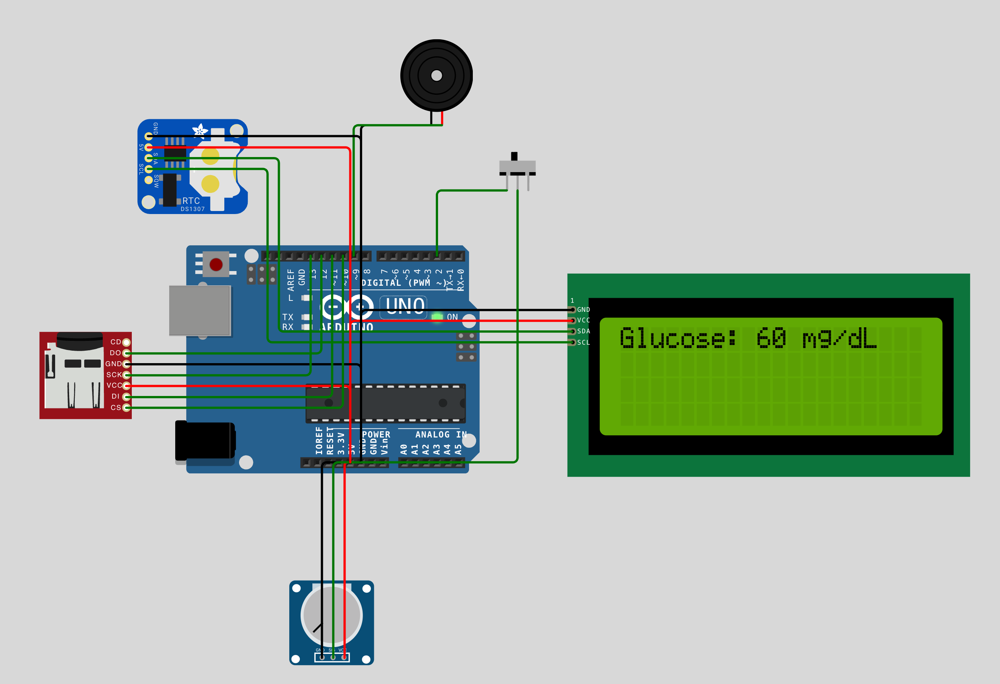

# System monitorowania poziomu glukozy we krwi (Arduino / Wokwi)

> Link do projektu: https://wokwi.com/projects/443629393584293889

## Opis projektu
Projekt przedstawia symulowany system monitorowania poziomu glukozy we krwi z wykorzystaniem platformy **Arduino UNO** w środowisku **Wokwi**.  
Celem projektu jest ciągły pomiar poziomu glukozy, jego prezentacja na wyświetlaczu LCD, sygnalizacja stanów alarmowych oraz archiwizacja danych pomiarowych.

System umożliwia:
- bieżący odczyt poziomu glukozy (symulowany potencjometrem),
- wykrywanie stanów: **normalny**, **ostrzegawczy**, **krytyczny**,
- sygnalizację alarmów dźwiękowych,
- wyświetlanie danych na LCD i w monitorze szeregowym,
- archiwizację danych i prezentację statystyk czasowych.

---

## Środowisko i narzędzia
- Arduino UNO
- Wokwi Simulator
- Język: C/C++ (Arduino)
- Biblioteki:
    - `Wire.h`
    - `LiquidCrystal_I2C.h`
    - `RTClib.h`
    - `SD.h`

---

## Elementy systemu

### Wejścia
- **Potencjometr (A0)** – symulacja czujnika glukozy (zakres 0–300 mg/dL)
- **Przycisk** – przełączanie trybów wyświetlania (tryb bieżący / archiwalny)

### Wyjścia
- **Wyświetlacz LCD 16x2 (I2C)** – prezentacja wartości, stanów i komunikatów
- **Buzzer** – sygnalizacja dźwiękowa stanów alarmowych
- **Serial Monitor** – diagnostyka i logi pomiarów

---

## Logika działania

1. Odczyt wartości z wejścia analogowego (potencjometr).
2. Przeliczenie sygnału na wartość glukozy w mg/dL.
3. Porównanie z progami alarmowymi.
4. Wyświetlenie aktualnego stanu systemu.
5. Opcjonalna archiwizacja danych wraz ze znacznikiem czasu (RTC).
6. Generowanie alarmów dźwiękowych w stanach ostrzegawczych i krytycznych.

---

## Progi alarmowe
Wartości progowe są zdefiniowane jako **stałe konfiguracyjne** w kodzie:

- **Stan normalny:** < 140 mg/dL
- **Stan ostrzegawczy:** 140–199 mg/dL
- **Stan krytyczny:** ≥ 200 mg/dL

---

## Interfejs użytkownika (LCD)

### Tryb bieżący
- Aktualna wartość glukozy (mg/dL)
- Aktualny stan systemu (NORMAL / WARNING / CRITICAL)
- Wskaźnik graficzny poziomu

### Tryb archiwalny
- Średnia wartość glukozy:
    - z ostatniej minuty
    - z ostatniej godziny
- Informacja o zapisie danych na kartę SD

---

## Alarmy
- **Stan ostrzegawczy** – sygnał dźwiękowy o średniej częstotliwości
- **Stan krytyczny** – sygnał dźwiękowy o wysokiej częstotliwości
- Alarmy są aktywne tylko po przekroczeniu progów.

---

## Testy i scenariusze

Przeprowadzone scenariusze testowe:
1. **Stan normalny** – wartości poniżej 140 mg/dL
2. **Stan graniczny** – wartości blisko progów alarmowych
3. **Stan alarmowy (krytyczny)** – wartości ≥ 200 mg/dL
4. **Tryb archiwalny** – poprawność obliczeń średnich

Zrzuty ekranu z Wokwi oraz opis testów znajdują się w dokumentacji PDF.

---

## Jak uruchomić projekt

1. Otwórz link do projektu w **Wokwi** (publiczny).
2. Upewnij się, że:
    - podłączony jest potencjometr do A0,
    - LCD działa na adresie I2C `0x27`,
    - buzzer i przycisk są poprawnie podłączone.
3. Uruchom symulację.
4. Zmieniaj wartość potencjometru, aby testować różne stany systemu.
5. Użyj przycisku, aby przełączać tryby wyświetlania.

---

## Struktura plików
